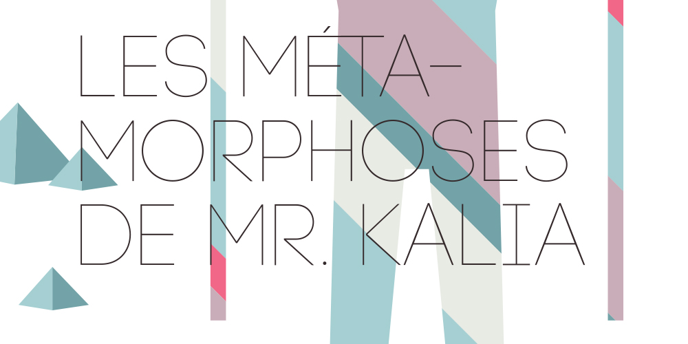
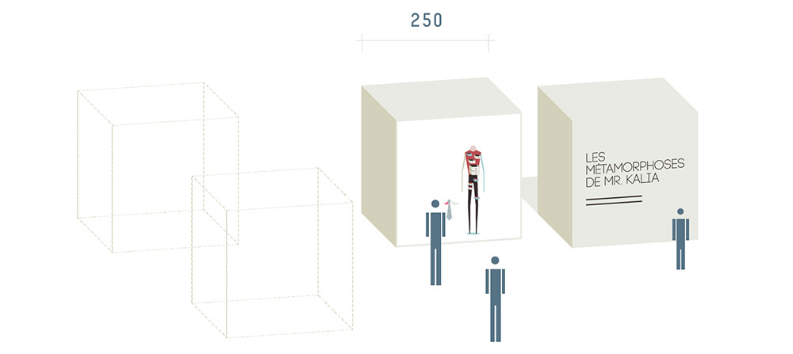
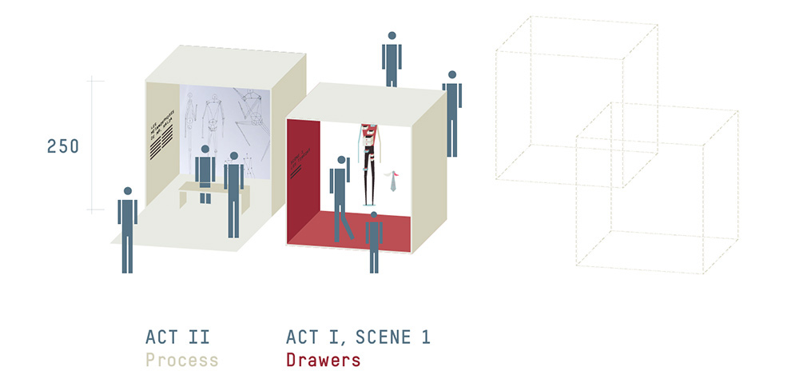
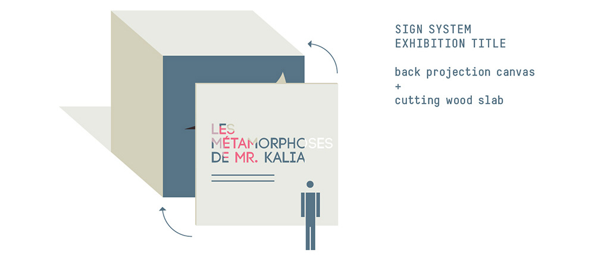

## Authors

### • Cyril Diagne
Cyril Diagne, leaves in Montreuil (eastern Paris suburb), plays a lot with different kind of technologies, that he tries to merge with unconventional techniques and people to create unique experiences. Graduated from Les Gobelins in 2008 he studied graphic design, programming and then co-founded the collective lab212 along with 5 other students, where he is now a freelance creative technologist.

[Website](http://kikko.fr) | [Github](http://github.com/kikko) | [Twitter](http://twitter.com/kikko_fr) 

### • Béatrice Lartigue 
Béatrice Lartigue is an art director with a poetic and humanistic approach. She enjoys designing for people, regardless their age or their technological background. Béatrice likes having a global vision of the projects she’s working on, and using her skills in architecture to think about spaces around physical installations.

[Website](http://epure.it) | [Github](http://github.com/epure) | [Twitter](http://twitter.com/epure_)

### • About the authors

Béatrice and Cyril are both members of the collective **lab212**. From UX design to graphic design, programming, electronics and technical design, they try to get involved in most aspects required by innovative interactive projects. From their sensible, poetic and tangible approach of interactive design, their projects try to empower users and cast a different light on the technology surrounding our daily lives. Through their creations, they invite people to think about our relation with the world we live in and the people we live with.

## Images & Videos

https://www.youtube.com/watch?v=L07v4rNvKKI&hd=1

## Description

**_Les métamorphoses de Mr. Kalia_ (M. Kalia metamorphosis) is an interactive poetic adventure and a study of the concept of metamorphosis, the natural capacity of animals to abruptly change their body structure. To explore this topic, we invite the audience to personify Mr. Kalia as he goes through many surrealistic metamorphoses.**

Human bodies also face many different kinds of abrupt changes : unique or recurring, biological or artificial, physical or psychological, caused or inflicted. 
As a reflection of these human 'metamorphoses', each phase that Mr. Kalia goes through, conveys feelings related to change, evolution and adaptation.

Mr. Kalia can be brought to life by any person from the audience through the use of a skeleton tracking technology.
The application provides various interactions that give different possibilities in progressing through the story, and a unique animated experience each time.

Imagined with simplicity in mind, this interactive installation is targeted to a broad range of people and can be installed in a wide variety of places. Also accessible from a web browser, people can watch the resulting animations live. 

#### Teaser

### • Space setup and suggested scenography

#### Front view :

#### Rear view :

### • Scenario

Staged as a theatre scenes, M. Kalia metamorphoses follow each other through distinct scenes.
Each of them is followed by a short pause anouncing the upcoming scene name and context. This the visitor can briefly let the finished scene resonate in his mind, and then get ready for the next one.

In the final piece, we would like to include about 20 different scenes that would all treat different aspects and different kinds of metamorphosis. Due to the context of the competition, we concentrated our efforts on prototyping only 7 of them.

#### → Scene flow

The scenes follow each other that way :

- Screen 1 : Act number and scene number displayed over a colored background
- Screen 2 : Scene name and a short phrase providing the context
- Screen 3 : curtain opens with Mr. Kalia on stage
- Screen 4 : [Scene content]
- Screen 5 : Scene end reached, curtain closes

Each metamorphosis is displayed as a painting, without camera movement, making M. Kalia part of the screening environement. It puts him in the room, among the audience.

**Word of caution** the following storyboards are not final and are simply made as a stamp of our progress for the judging process. Please consider them as sketches of each of the scenes presented.

#### → Scene 1 : Drawers
_"Mr Kalia is here. But he needs to go to work."_

In this scene, Mr. Kalia sees drawers slowly appearing over his body and opening to let everyday's life clothes and accessory fly around, play with him like naughty kids and give him a hard time to be caught back.

**keywords :** social adaptation, personality drawers, routine

#### → Scene  : Stripes
_"Mr Kalia is out of his room. The sun shines."_

In this scene, Mr. Kalia seems invisible at the start. After a moment, we can distinguish his foot, and then his knees as a few stripes seemed to reveal them. As time goes and Mr Kalia moves around, his colorful silhouette becomes visible.

**keywords :** reaction, camouflage

#### → Scene  : Bulbs
_"Mr Kalia shares his body with a few handy items."_

In this scene, Mr. Kalia wears many light bulbs, forming an excentric costume, despite some nice color fading. However, as he pulls the cord and the whole scene turns dark, his body shines from the bulbs.

**keywords :** wearable devices, cyborg, technological upgrade of the body

#### → Scene  : Thorns
_"Mr Kalia pierced his body to make it his own."_

In this scene, Mr. Kalia is covered with thorns and flowers that look good but seem quite unconfortable. His hands control a waterfall that washes the thorns from his body.

**keywords :** expressive metamorphosis, tattoos, piercings

#### → Scene  : Tribal
_"Mr Kalia dreams he is being an eagle."_

In this scene, Mr. Kalia controls a fire as his body moves around in a tribal dance. Everything fades away as he removes his mask.

**keywords :** fantasy, ceremony, costume

#### → Scene  : Lockers
_"Mr Kalia has heavy lockers attached to his body."_

In this scene, Mr. Kalia carries some big lockers that make it hard for him to do any move. As a few keys open the lockers, sand falls from the sky forming a big pile, and lockers get detached from the body.

**keywords :** secrets, revealing, releasing

#### → Scene  : Tree
_"Mr Kalia has been around for a very long time."_

In this scene, Mr. Kalia's body slowly grows branches, leaves, nests and even birds houses. After a while, birds start making his body their home.

**keywords :** evolution, symbiosis

### Design

Inside each scene, the metamorphosis is depicted through 4 elements :

- The body elements
- The scenery
- The interaction(s)
- The music

The minimalistic aesthetics give an appealing first layer of information and symplify access to complex interactions with the audience.

Mr Kalia's silhouette is simple and slender. It can adapt to many different morphological changes and 'body upgrades'

### Technical setup:

A wide-angle video-projector will prevent the user from creating shadows on the projection canvas.

The animation is projected using Google Chrome in presentation mode. Because of the vector graphic library we use, the application adapt to any resolution and pixel density.

The experience is also be accessible live from the browser, and because only tracking datas are streamed, people with relatively slow connection (edge/3g) can access it as well.

## Link to prototype

To give everyone access to the prototype, we've recorded some very basic body gestures that we stream through our Google Compute Engine.

- You can access the non-interactive demo here : [Mr. Kalia prototype - stream](kikko.fr/lab/devart/wip)
- The code of this application is available on the [github repository](https://github.com/kikko/devart-template/tree/master/project_code/prod)
- If you want to try the interactive version, the [skeleton tracking application](https://github.com/kikko/devart-template/tree/master/project_code/prod/installation/NiTE2-userTracking) is also available (OSX only for now).

## Next steps

- The immediate next step would be to finish the existing scenes, adding more interactions, items and bring in new scenes in order to reach ~20 scenes.

- Welcome a musician / sound designer in the team to work actively on the sound design of the piece. We expect to eventually adapt some aspect of the project to match the sound designer's work.
- Explore the interaction possibilities offered by the live streaming, accessible anywhere from a simple web browser. Scalability of the concept, is what has prevented us from including it so far.

## Links to External Libraries

** Skeleton Tracking : **

- [OpenFrameworks](http://www.openframeworks.cc)
- [OpenNI2 & NiTE2](http://www.openni.org)
- [ofxNi2](https://github.com/satoruhiga/ofxNI2)
- [ofxLibWebsocket](https://github.com/labatrockwell/ofxLibwebsockets)

** Front-end : **

- [Google Chrome](www.google.com/chrome)
- [Coffeescript](http://coffeescript.org)
- [Jade](http://jade-lang.com)
- [Stylus](http://learnboost.github.io/stylus)
- [Paper.js](http://paperjs.org)
- [Tween.js](https://github.com/sole/tween.js) 

** Back-end : **

- [NodeJS](http://nodejs.org)
- [Socket.IO](http://socket.io)

** Tools and workflow : **

- [Cake](http://coffeescript.org/documentation/docs/cake.html)
- [Paper.js sketchpad](http://sketch.paperjs.org)
- [SVG](http://www.w3.org/Graphics/SVG/)
